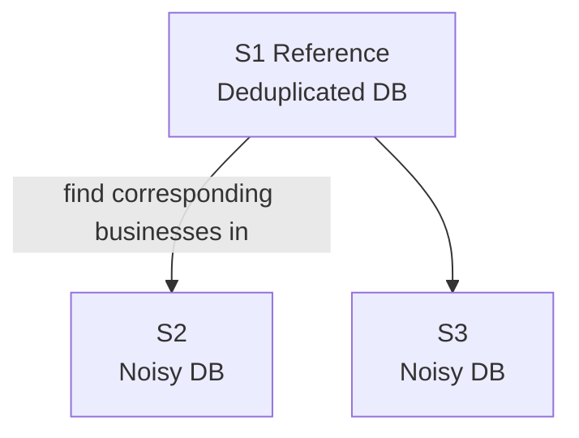
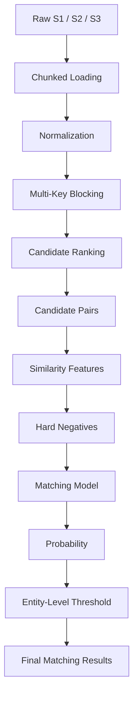
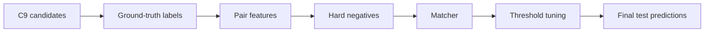
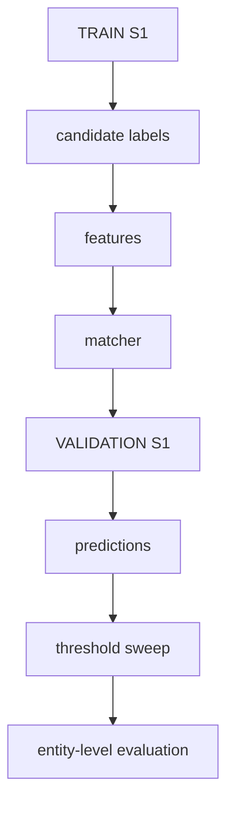
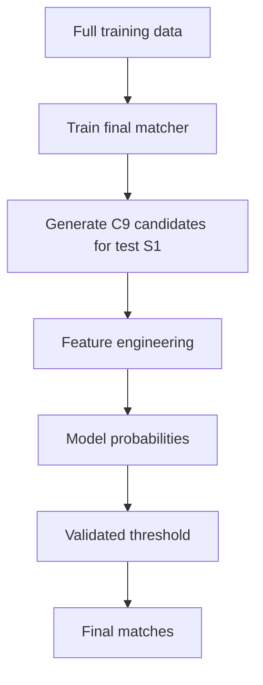
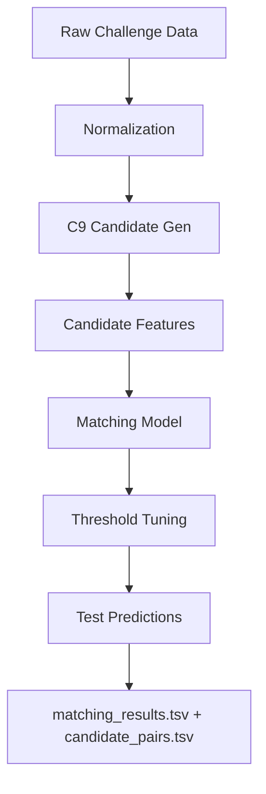

# 🏆 Amazon ML Challenge 2026 — Business Entity Resolution Pipeline

<p align="center">
<b>High-Recall Candidate Generation → Hard-Negative Matching → Precision-Aware Entity Resolution</b>
</p>

<p align="center">


</p>

> **Note:** The **92.35%** figure in this README is **blocking recall** on the validated 49,996‑S1 evaluation sample — **not** the final competition score.

---

## 📑 Table of Contents

1. [Project Status](#-project-status)
2. [What Are We Solving?](#-what-are-we-solving)
3. [Why This Is Hard](#-why-this-is-hard)
4. [System Architecture](#-system-architecture)
5. [Person A — Data Engineering & Candidate Generation](#-person-a--dharmi-sapariya)
6. [Blocking Experiments (E1 → E8/C9)](#-candidate-generation-experiments)
7. [C9 Blocking Strategy](#-c9-blocking-strategy)
8. [C9 Validation Results](#-c9-validation)
9. [Missed-Pair Forensics](#-missed-pair-forensics)
10. [Person B — Matching Stage (Execution Guide)](#-person-b--matching-stage)
11. [Repository Structure](#-recommended-repository-structure)
12. [Final Checklist](#-person-b--exact-execution-checklist)
13. [Definition of Done](#-definition-of-done)
14. [Team](#-team)

---

## 🧭 Project Status

| Stage | Status |
|---|---|
| Dataset exploration | ✅ Complete |
| Normalization | ✅ Complete |
| Memory-aware preprocessing | ✅ Complete |
| Blocking experiments | ✅ Complete |
| Candidate generation | ✅ Complete |
| Candidate recall validation | ✅ Complete |
| Missed-pair investigation | ✅ Complete |
| Matching features | 🔄 Person B |
| Hard-negative training | 🔄 Person B |
| Matcher | 🔄 Person B |
| Threshold optimization | 🔄 Person B |
| Full test inference | ⏳ Pending |
| Final submission | ⏳ Pending |

---

## 🎯 What Are We Solving?

This is a **noisy business entity resolution** problem.



For every S1 entity, the system must determine one of:

- **0** matches
- **1** match
- **Multiple** matches

⚠️ **The system must not assume one-to-one matching.**

---

## 🧠 Why This Is Hard

The same business may appear as:

- `Primary Care Specialists Inc`
- `Primary Care Specialists Incorporated`
- `primary care stpianlsts inc`

...or:

- `Straight Edge Hypnosis`
- `Straight Edge Hpyosris`

Addresses can also contain abbreviations, missing components, reordered components, spelling differences, transliteration, landmarks, and numbering differences.

<details>
<summary><b>So why not just do a simple match?</b> (click to expand)</summary>

| Approach | Works? |
|---|:---:|
| Exact match | ❌ |
| Normalization only | ❌ |
| One giant fuzzy search | ❌ |
| **Two-stage entity resolution** | ✅ |

</details>

---

## 🏗️ System Architecture



The project is deliberately split into two stages:

| Stage | Goal |
|---|---|
| **A — Retrieval / Blocking** | Find a high-recall set of *plausible* candidates |
| **B — Matching** | Decide which candidates are *actually* the same entity |

---

## 👨‍💻 Person A — Dharmi Sapariya
### Data Engineering + Candidate Generation

Responsible for the complete **retrieval side** of the pipeline. The core engineering question:

> **How do we reduce millions of possible comparisons while keeping true matches inside the candidate set — since a matcher can never recover a true pair that blocking never gives it?**


### Work completed
- **Dataset exploration** — schema, missing values, name/address quality, country distribution, duplicates, normalization needs, candidate-explosion risks (validated using the training ground truth)
- **Memory-aware normalization** — chunked loading (`chunksize=100000`) → lowercase → Unicode NFKD → accent removal → `&`→`and` → punctuation removal → non-alphanumeric cleanup → whitespace normalization. Both normalized names *and* normalized addresses were retained.
- **Iterative candidate generation** — 8 blocking strategies tested against recall, candidate volume, memory usage, runtime, and scalability.

---

## 🧪 Candidate Generation Experiments

<details>
<summary><b>Experiment 1 — Simple Prefix + Address Blocking</b> ❌ ~24% recall</summary>

**Idea:** Name first 4 characters + address last token.
**Result:** ~24% blocking recall.
**Why it failed:** Too brittle — business names have different ordering, abbreviations, typos, and legal-suffix differences; addresses vary substantially.
**Decision:** Rejected.
</details>

<details>
<summary><b>Experiment 2 — Broad Multi-Key Blocking</b> ❌ Candidate explosion</summary>

**Idea:** Name tokens + prefixes + Soundex + address tokens/prefixes + digit/anchor combos, with frequency limits and caps.
**Result:** ~4,615 candidates per S1 — too large a downstream search space.
**Decision:** Too broad for the main pipeline.
</details>

<details>
<summary><b>Experiment 3 — Phonetic Blocking</b> ❌ Memory explosion</summary>

**Idea:** Soundex-style phonetic representations for typo tolerance.
**Result:** Index expansion from combining many signatures/variants made memory usage impractical.
**Decision:** Rejected as primary index.
</details>

<details>
<summary><b>Experiment 4 — Character TF-IDF (brute-force)</b> ❌ Too expensive</summary>

**Idea:** Character-level TF-IDF tolerates typos, spacing differences, small edits, abbreviations.
**Result:** Brute-force nearest-neighbor over millions of records was too expensive, despite a useful representation.
**Decision:** Rejected.
</details>

<details>
<summary><b>Experiment 5 — Chunked TF-IDF</b> ❌ Still too expensive</summary>

**Idea:** Reduce memory pressure by chunking TF-IDF retrieval.
**Result:** Memory improved, but nearest-neighbor computation against the full database remained too costly.
**Decision:** Not used in production.
</details>

<details>
<summary><b>Experiment 6 — Generated Character Signatures</b> ❌ Memory explosion</summary>

**Idea:** Lightweight signature-based retrieval.
**Result:** Combining phonetic signatures, deletions, character shapes, and variants created a huge Python index.
**Decision:** Rejected.
</details>

<details>
<summary><b>Experiment 7 — Coarse Character Blocking</b> ❌ 0 pairs recovered</summary>

**Idea:** Strict blocker on country + first/last characters + length bucket.
**Result:** Zero additional true candidate pairs recovered on validation.
**Decision:** Rejected.
</details>

<details open>
<summary><b>Experiment 8 / C9 — Multi-Key Blocking</b> ✅ 92.35% validated recall</summary>

**Idea:** Don't rely on one fragile key — combine several independent keys and rank candidates by how many signals support them.
**Result:** **92.35% validated blocking recall.**
**Decision:** ✅ Adopted as the production blocker.
</details>

### 📋 Experiment Log

| Experiment | Strategy | Result | Decision |
|---|---|---|:---:|
| E1 | Prefix + address tail | ~24% recall | ❌ |
| E2 | Broad multi-key | Very large candidate volume | ❌ |
| E3 | Phonetic indexing | Memory explosion | ❌ |
| E4 | Brute-force TF-IDF | Too expensive | ❌ |
| E5 | Chunked TF-IDF | Still expensive | ❌ |
| E6 | Generated signatures | Memory explosion | ❌ |
| E7 | Coarse character blocker | 0 additional pairs | ❌ |
| **E8 / C9** | **Multi-key blocking** | **92.35% validated recall** | ✅ |

*This history is retained intentionally — it shows why the current architecture exists.*

---

## 🔑 C9 Blocking Strategy

**Principle:** Do not depend on one fragile key. Use several independent keys and rank candidates by how many signals support them.

<table>
<tr><th>Name keys</th><th>Address keys</th></tr>
<tr><td>

| Key | Meaning |
|---|---|
| `NT` | Distinctive exact token |
| `NP5` | 5-char token prefix |
| `NP6` | 6-char token prefix |
| `NE` | Whole normalized name |
| `NS` | Sorted normalized name tokens |

</td><td>

| Key | Meaning |
|---|---|
| `AT` | Exact address token |
| `AP6` | 6-char address prefix |
| `AN` | Number + address token |

</td></tr>
</table>

**Additional controls:** country-aware keys · generic stopword filtering · maximum key frequency · maximum candidates per S1.

### 🚫 Generic token filtering
Common business terms are excluded from becoming dominant blocking signals — e.g. `the, and, for, inc, llc, ltd, limited, company, corp, corporation, co, corporate, group, services, service, solutions, international, india, usa, us` — so a token like `"company"` never produces an enormous candidate group.

### 🌍 Country-aware blocking
Keys are effectively scoped as **`(country, blocking_key)`** rather than a bare `blocking_key`, reducing unrelated cross-country collisions while preserving the challenge's open-set behavior.

### ⚙️ C9 Configuration

```text
MAX_KEY_FREQUENCY      = 1200
MAX_CANDIDATES_PER_S1  = 500
MIN_TOKEN_LEN          = 3
```

Candidates are ranked by **number of independent blocking keys shared** → higher score = stronger candidate → capped by the candidate limit.

---

## 📈 C9 Validation

Validated against actual ground-truth relationships for the exact S1 entities being evaluated:

| Metric | Value |
|---|---:|
| S1 entities evaluated | 49,996 |
| Candidate pairs | 24,104,327 |
| Ground-truth true links | 173,213 |
| True links recovered | 159,970 |
| True links missed | 13,243 |
| **Blocking recall** | **92.35%** |

$$\text{Recall} = \frac{159{,}970}{173{,}213} \times 100 = 92.35\%$$

> This is the measured **recall ceiling** of the validated candidate-generation pipeline on this sample — not the final competition score.

---

## 🔍 Missed-Pair Forensics

The 13,243 missed true links → **9,606 unique S1 entities** were explicitly extracted and investigated using RapidFuzz similarity (rather than guessed at).

| Similarity condition | Pairs | % of missed |
|---|---:|---:|
| Name WRatio ≥ 70 | 9,799 | — |
| Address WRatio ≥ 70 | 9,809 | — |
| **Either field ≥ 70** | **13,064** | **≈ 98.65%** |
| **Either field ≥ 80** | **12,477** | **≈ 94.21%** |

**Key finding:** the remaining missed matches weren't wholly dissimilar — most still had recoverable evidence in either the business **name** or the **address**.

> ### 🧠 Critical insight for Person B
> Do **not** build a matcher that relies only on business-name similarity. Missed pairs showed patterns like *strong name + weak address* and *weak/missing name + strong address*. Treat **NAME + ADDRESS + MISSINGNESS + STRUCTURAL INFORMATION** as complementary evidence.

---

## 🤝 Person B — Matching Stage
### Your job starts here — the candidate generator is ready

> ⚠️ Do not restart candidate generation unless validation demonstrates a specific recall problem.



### 1️⃣ Label the candidate pairs
- `match = 1` if the exact pair appears in `train_ground_truth.tsv`, else `match = 0`.
- **Split by S1 entity**, not by candidate row — random row-splitting lets candidates from the same S1 leak between train/validation.

```text
S1 entities → train S1 / validation S1   ✅
candidate rows → random split            ❌
```

### 2️⃣ Build strong pair features

<details>
<summary><b>Name features</b></summary>

WRatio · Ratio · Token Sort Ratio · Token Set Ratio · Levenshtein similarity · Jaccard token similarity · exact normalized match · token overlap · length difference
</details>

<details>
<summary><b>Address features</b></summary>

WRatio · Ratio · Token Sort Ratio · Token Set Ratio · Levenshtein similarity · Jaccard similarity · exact normalized match · token overlap · number overlap · postcode overlap · length difference
</details>

<details>
<summary><b>Structural features</b></summary>

Country match · name missing flag · address missing flag · name length · address length · shared token count · shared numeric tokens
</details>

<details>
<summary><b>Blocking features (preserve these!)</b></summary>

Number of shared blocking keys · which blocking keys fired · candidate rank · candidate score

These tell the model not just *"how similar are these records?"* but *"why did these records become candidates?"*
</details>

### 3️⃣ Hard negative mining — **critical**

| Negative type | Example | Value to the model |
|---|---|---|
| Random negative | similarity = 4% | Low — teaches little |
| **Hard negative** | name sim = 95%, address sim = 90%, match = 0 | **High** — teaches *"very similar ≠ same entity"* |

Mine negatives from candidates with **high similarity but incorrect ground-truth labels**.

### 4️⃣ Train the matcher
- Primary: **LightGBM** or **XGBoost**
- Fallback: `HistGradientBoostingClassifier`
- Target: `1` = same entity, `0` = different entity → outputs `P(match)`

### 5️⃣ Do **not** default to threshold = 0.5
The challenge metric is **precision-heavy**. Sweep a threshold grid and evaluate at the **entity level**, not just pair-level accuracy:

```text
0.50  0.55  0.60  0.65  0.70  0.75  0.80  0.85  0.90  0.95
```

### 6️⃣ Evaluate per S1 entity
For every S1: `predicted matches` vs `ground-truth matches` → compute the challenge-style **F0.5** behavior. Watch closely for false positives, false merges, missed true matches, and correct empty predictions.

### 🚨 Singletons / empty matches are valid
```text
S1-A    S2-123
S1-B
S1-C    S3-456
S1-D    S2-111,S3-222
```
An empty S1 row is a **valid** output — a random weak match can be worse than correctly predicting *no match*.

### 7️⃣ Multiple matches are allowed
Do **not** force one-to-one. Each S1 may map to zero, one, or multiple S2/S3 entities — inference must consider all sufficiently confident candidates independently.

### 8️⃣ Train → Validate → Error analysis



Then inspect:
- **False positives** — why did the model merge these businesses?
- **False negatives** — why did the model reject these true matches?
- **Difficult entities** — blank name + strong address · strong name + blank address · common business name · multiple legitimate matches

### 🧪 Final test pipeline



---

## 📦 Required Final Files

```text
output/
├── matching_results.tsv
└── candidate_pairs.tsv

code/
├── normalize.py
├── build_candidates.py
├── validate_candidates.py
├── build_features.py
├── train_matcher.py
└── generate_submission.py

requirements.txt
README.md
```

---

## ✅ Final Output Validation

Before submission, automatically check:

| Check | Assertion |
|---|---|
| Every test S1 appears | `output_s1_count == test_s1_count` |
| No duplicate S1 rows | `duplicate_s1_count == 0` |
| No invalid entity IDs | `invalid_entity_ids == 0` |
| Every predicted pair exists in `candidate_pairs.tsv` | `predictions_outside_candidate_set == 0` |
| Empty matches allowed | never drop no-match S1 entities |

```python
assert output_s1_count == test_s1_count
assert duplicate_s1_count == 0
assert invalid_entity_ids == 0
assert predictions_outside_candidate_set == 0
```

This prevents a technically good model from failing on output-format mistakes.

---

## 📁 Recommended Repository Structure

```text
Amazom_ML_Challenge_2026/
│
├── README.md
├── requirements.txt
│
├── code/
│   ├── normalize.py
│   ├── build_candidates.py
│   ├── validate_candidates.py
│   ├── build_features.py
│   ├── train_matcher.py
│   └── generate_submission.py
│
├── notebooks/
│   ├── person_a_candidate_generation.ipynb
│   ├── person_a_validation.ipynb
│   └── person_b_matching.ipynb
│
├── reports/
│   ├── candidate_recall.md
│   ├── error_analysis.md
│   └── experiment_log.md
│
├── output/
│   ├── candidate_pairs.tsv
│   └── matching_results.tsv
│
└── artifacts/
    └── metrics/
```

> Do not commit the massive raw datasets unless the competition explicitly permits and requires it. Commit code, notebooks, reports, configuration, and reasonably sized artifacts.

---

## 🚀 Person B — Exact Execution Checklist

- [ ] Load C9 candidate pairs
- [ ] Label candidates from ground truth
- [ ] Split by S1 entity
- [ ] Build name similarity features
- [ ] Build address similarity features
- [ ] Build missingness features
- [ ] Build numeric/postcode features
- [ ] Preserve blocking features
- [ ] Mine hard negatives
- [ ] Train LightGBM/XGBoost
- [ ] Validate at entity level
- [ ] Sweep probability thresholds
- [ ] Analyze false positives
- [ ] Analyze false negatives
- [ ] Lock threshold
- [ ] Generate full-test C9 candidates
- [ ] Generate test features
- [ ] Run final matcher
- [ ] Generate `matching_results.tsv`
- [ ] Generate `candidate_pairs.tsv`
- [ ] Validate output structure
- [ ] Run final submission

---

## 🏁 Definition of Done



---

## 🧠 The Main Principle

> Do not make the blocker solve matching.
>
> - The **blocker** answers: *"Could these two records reasonably represent the same business?"*
> - The **matcher** answers: *"Given that they are plausible candidates, are they actually the same business?"*

That separation keeps the system **scalable + measurable + debuggable + model-friendly**.

---

## 👥 Team

| Member | Role |
|---|---|
| **Dharmi Sapariya** | Data Engineering · Normalization · Blocking · Candidate Generation · Recall Validation · Error Analysis |
| **Jasmine** | Matching · Feature Engineering · Hard Negatives · Model Training · Threshold Optimization · Final Submission |

<p align="center"><i>Amazon ML Challenge 2026</i></p>
