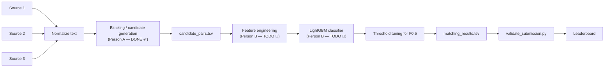

# 🏆 Amazon ML Challenge 2026 — Business Entity Resolution

**Team deadline: finish by Saturday night. Sunday = exam prep, unavailable.**

Person A (blocking/candidate generation) is **done**. This README is the handoff to
Person B (features, model, submission) — read the whole thing before writing code,
it'll save you time.

---

## 🧩 The problem, in one paragraph

Three business listings (Source 1, 2, 3) describe the same real businesses with no
shared ID — names and addresses differ by typos, abbreviations, word order, missing
fields, even script/language. For every Source 1 entity, find its true matches (zero,
one, or many) in Source 2/3. Scored on **F₀.₅** — precision matters **2×** more than
recall, so a wrong match hurts more than a missed one. Correctly predicting "no match"
for a singleton is worth full credit; a false match on a singleton costs everything.

---

## 🏗️ Pipeline architecture



---

## ✅ Person A — completed work

### What was done
1. **Normalization** (`code/normalize.py`) — lowercased, stripped punctuation, removed
   legal suffixes (Pvt Ltd, LLC, Inc...), expanded address abbreviations (Rd→Road,
   St→Street...) with word-boundary regex.
2. **Blocking / candidate generation** — see the version history below. This is the
   part that took real iteration; it's documented in full because it doubles as the
   methodology write-up.

### 🔬 Blocking key evolution (the debugging journey — useful for `Documentation_template.md`)

| Version | Approach | Train recall | Problem found |
|---|---|---|---|
| v2 | Name first-4-chars prefix + address last-token | **0.24** | Generic first words ("the", "private") got dropped by the group-size cutoff needed to avoid OOM |
| v5 | Longest word in name + soundex + first address digit token (streaming, dict-based — no pandas merges, fixed repeated OOM kills) | **0.36** | 50% of S1 entities got **zero candidates**. Diagnosed via `diagnose_orphans.py` + `inspect_false_negatives.py` on real false-negative pairs: the "longest word" was often a generic category term (*investments, enterprises, ventures, solutions*) common across thousands of businesses → banned as too-common. Plain address house-numbers (e.g. "3315") also too common → banned. |
| v7 | Excluded generic category words, used **top-2** significant words (not just 1) so a match survives even if one source drops a distinguishing word, address digit+anchor-word compound keys, distinctive-address-word key | Not measured — too slow (>1M candidates/S1 avg, ~6GB output) | Candidate sets ballooned; sorting them per row made the run impractically slow and filled disk |
| v8 | Same as v7 but dropped the overly-common plain digit fallback (kept only the specific digit+anchor compound), removed unnecessary sorting on output | 🔲 **TODO — fill in after running** | — |

> **Full evidence trail**: `code/diagnose_orphans.py` and `code/inspect_false_negatives.py`
> pulled real S1↔true-match pairs and printed the actual normalized text side by side —
> that's what drove every key design decision above. Worth keeping in the final
> submission zip as proof of an evidence-based approach, not guesswork.

### Current blocking architecture (`code/build_candidates_v8.py`)

| Key family | Signal | Why |
|---|---|---|
| `key_name_word` | Top-2 significant words in the name (generic category words excluded) | Survives when a business's category word (e.g. "Investments") differs or is dropped |
| `key_name_word_soundex` | Soundex of those same words | Catches typos/spelling variants |
| `key_addr_digit` | House/plot number + nearby non-generic anchor word | Plain house numbers are too common alone; pairing with a nearby word makes it specific |
| `key_addr_word` | Distinctive address word (not "street"/"road"/"floor" etc.) | Links records even when the business name is unrelated across sources (e.g. a specific town name) |

All keys are **country-scoped** and any key shared by more than `MAX_GROUP_SIZE` (300)
records on either side is dropped — this is what keeps the pipeline from exploding into
a giant cross-product join (which caused repeated out-of-memory crashes on 8GB RAM).

### 🎯 Targets (from the official playbook — fill these in before handoff)

| Metric | Target | Our result |
|---|---|---|
| Train candidate recall | ≥95% (aim 97–99%) | 🔲 TODO |
| Average candidates / S1 | Hundreds, not thousands | 🔲 TODO |
| P95 / P99 / max candidates | Measure it | 🔲 TODO |
| Zero-candidate rate | As low as possible | 🔲 TODO |
| Duplicate candidates | 0 | ✅ (set-based, guaranteed) |
| Missing S1 rows | 0 | 🔲 verify with `validate_submission.py` |

**⚠️ Important nuance**: don't just chase max recall. A blocker with 99% recall and
thousands of candidates/S1 is *worse* for the final F₀.₅ score than a slightly lower-recall
blocker with hundreds of candidates/S1 — Person B's model has to sift through everything
you hand it, and F₀.₅ punishes false positives hard. If `output/raw_candidates_train.tsv`
looks huge (hundreds of MB+), that's a signal to tighten blocking further, not a win.

### Files Person A hands off

- `output/raw_candidates_train.tsv` — candidates for every train S1 entity
- `output/raw_candidates_test.tsv` — candidates for every test S1 entity (run
  `python3 code/build_candidates_v8.py test` — same script, no recall check possible)
- `code/normalize.py`, `code/build_candidates_v8.py` — reproducible pipeline
- `code/diagnose_orphans.py`, `code/inspect_false_negatives.py` — diagnostic tools, keep
  these, they're evidence for the methodology doc

---

## 🚀 Person B — what to do next

Your job starts from `output/raw_candidates_train.tsv` / `raw_candidates_test.tsv`.
**Do not re-run blocking** — your matching model only ever scores what's already in
these files (per the rules, `matching_results.tsv` must be a subset of
`candidate_pairs.tsv`).

### Step 1 — Build pairwise features (`code/features.py`)
For every `(source1_entity_id, candidate_entity_id)` pair, compute similarity features:
- `name_ratio`, `name_token_sort` (rapidfuzz — handles typos and word reordering)
- `addr_ratio`, `addr_token_sort`
- `country_match`
- Optional but valuable given our blocking evidence: **which key families matched**
  (e.g. did `key_name_word` match? `key_addr_word`?) as binary features — this gives
  the model a signal correlated with confidence.

### Step 2 — Label training pairs
Use `dataset/train/train_ground_truth.tsv` to build the set of true `(s1_id, other_id)`
pairs, label every candidate pair 0/1.

### Step 3 — Train (LightGBM — MIT-licensed, satisfies the ≤8B param rule trivially)
```python
import lightgbm as lgb
model = lgb.LGBMClassifier(n_estimators=300, learning_rate=0.05)
model.fit(X_train, y_train)
```

### Step 4 — Threshold tuning (**this is where the score is actually won**)
F₀.₅ weights precision 2× over recall. Sweep thresholds (0.5 → 0.95) on a held-out
split and pick whichever maximizes F₀.₅ — **not accuracy, not raw recall**. When in
doubt, lean toward the *higher* threshold. Be conservative on singletons: predicting
any match on a true singleton drops that entity's score straight to 0.

### Step 5 — Predict on test, write both output files
- `output/matching_results.tsv` — final matches, **this is what gets uploaded**
- `output/candidate_pairs.tsv` — every candidate you scored at inference (not just
  accepted ones) — every S1 test entity needs exactly one row, even with an empty list

### Step 6 — Validate before every submission
```bash
python3 utils/validate_submission.py \
  --matching output/matching_results.tsv \
  --candidate output/candidate_pairs.tsv \
  --test-dir dataset/test
```
Must print `PASS`. Fix and re-run until it does — you have only 5 submissions/day.

### If you're short on time
A simple rule beats an empty submission: predict a match if
`name_token_sort > 85 AND country_match == 1`. Submit that first, improve after.

---

## 📂 Repo structure

```
.
├── code/
│   ├── normalize.py                    # Person A
│   ├── build_candidates_v8.py          # Person A — current blocking pipeline
│   ├── diagnose_orphans.py             # Person A — diagnostic tooling
│   ├── inspect_false_negatives.py      # Person A — diagnostic tooling
│   ├── features.py                     # Person B — TODO
│   └── train.py                        # Person B — TODO
├── output/                             # gitignored — see Kaggle section below
├── dataset/                            # gitignored — download separately, see below
├── utils/
│   └── validate_submission.py
├── notebooks/
│   └── amazon-ml-challenge-2026.ipynb  # Kaggle notebook (8GB RAM workaround)
├── Documentation_template.md           # fill in together Saturday evening
├── requirements.txt
└── README.md
```

---

## ⚙️ Setup

```bash
git clone https://github.com/DharmiSapariya/Amazom_ML_Challenge_2026.git
cd Amazom_ML_Challenge_2026
python3 -m venv venv
source venv/bin/activate       # Windows: venv\Scripts\activate
pip install -r requirements.txt
```

**Dataset & candidate files are not in this repo** (too large for GitHub — see below).
Download them from the Kaggle dataset linked in the section below and place them at:
```
dataset/train/*.tsv
dataset/test/*.tsv
output/raw_candidates_train.tsv
output/raw_candidates_test.tsv
```

To regenerate candidates from scratch instead of downloading them:
```bash
python3 code/build_candidates_v8.py train
python3 code/build_candidates_v8.py test
```

---

## 📊 Kaggle

The full dataset (millions of rows/source) plus our large intermediate/output files
live on Kaggle (30GB RAM environment — used as a workaround for the 8GB local RAM
constraint that caused repeated OOM crashes during blocking development).

- **Kaggle notebook**: 🔲 `<add your Kaggle notebook link here>`
- **Kaggle dataset (large files)**: 🔲 `<add your Kaggle dataset link here>` —
  should contain `dataset/`, `output/normalized_*.tsv`, `output/raw_candidates_*.tsv`

A copy of the notebook is also kept at `notebooks/amazon-ml-challenge-2026.ipynb` in
this repo for reference (small enough to commit directly).

---

## 🧪 Submission checklist

- [ ] `candidate_pairs.tsv` has one row per test S1 entity, no duplicate candidate IDs
- [ ] `matching_results.tsv` has the required schema, one row per test S1 entity
- [ ] Every predicted pair in `matching_results.tsv` appears in `candidate_pairs.tsv`
- [ ] `validate_submission.py` prints `PASS`
- [ ] Train candidate recall measured and recorded above
- [ ] No external API calls, geocoding, or business-registry lookups anywhere in the code
- [ ] `Documentation_template.md` filled in (methodology, blocking strategy, model + features)
- [ ] Every submission's timestamp + score logged somewhere (required: version history)

---

## ⚠️ Rules reminder

- **No external data lookups** — no APIs, no geocoding, no business registry lookups.
  Instant disqualification if detected.
- Model must be **MIT/Apache 2.0 licensed, ≤8B parameters** — LightGBM easily satisfies this.
- Country is an **open set** — France appears only in test. Never hardcode `{US, India}`.
- Max **5 submissions/day**, 3-day window. Log every submission (timestamp, change, score).

---

## 🤝 Team

| | Owns | Status |
|---|---|---|
| Person A | Setup, normalization, blocking/candidate generation | ✅ Done |
| Person B | Features, model, threshold, submission | 🔲 Your turn |

Deadline: **Saturday night**. Sunday is exam prep for both of us — let's get this done. 🚀
